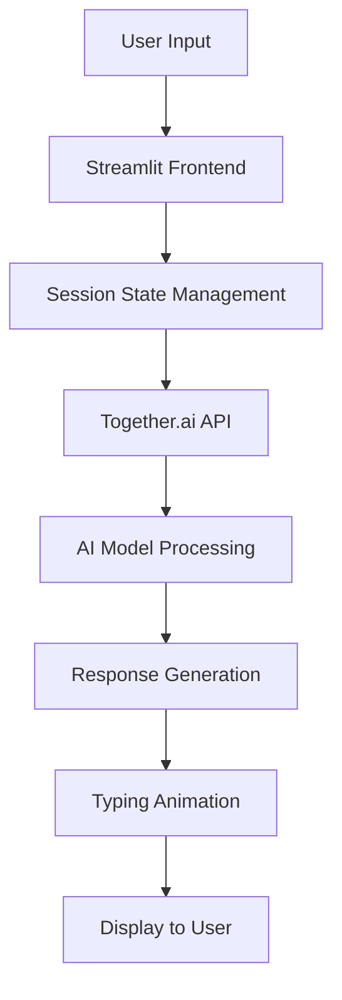

# 🤖 Sohan's GPT - AI Chat Assistant

<div align="center">

[](https://github.com/sohan2311/Sohan-s-GPT-AI-Chatbot-Assistant)

</div>

**A Beautiful, Feature-Rich AI Chat Interface Powered by Together.ai**

[](https://streamlit.io/)
[](https://python.org/)
[](https://together.ai/)

| [🛠️ Installation](#installation) | [🤝 Contributing](#contributing)

---

## 📸 Screenshots

<div align="center">

### Main Chat Interface


### Model Selection & Configuration


### Chat Statistics & Export


</div>

---

## ✨ Features

### 🎨 **Beautiful UI/UX**
- **Gradient Design**: Modern gradient backgrounds and smooth animations
- **Responsive Layout**: Optimized for desktop and mobile devices
- **Typing Animation**: Real-time typing effect for AI responses
- **Custom Styling**: Hand-crafted CSS for premium look and feel

### 🧠 **Multiple AI Models**
- **Mixtral 8x7B**: High-performance instruction-following model
- **Llama 3 8B/70B**: Meta's latest language models
- **CodeLlama 34B**: Specialized for code generation and assistance

### ⚙️ **Advanced Configuration**
- **Temperature Control**: Adjust creativity (0.0 - 2.0)
- **Token Limit**: Customize response length (50 - 4000 tokens)
- **Real-time Settings**: Change models and parameters on-the-fly

### 📊 **Smart Features**
- **Chat Statistics**: Track message counts and conversation metrics
- **Export Functionality**: Download chat history as JSON
- **Session Management**: Persistent chat history during session
- **Error Handling**: Robust error handling with user-friendly messages

### 🔧 **Technical Excellence**
- **Streaming Support**: Fast response delivery
- **Timeout Protection**: 30-second request timeout
- **API Integration**: Seamless Together.ai API integration
- **State Management**: Efficient Streamlit session state handling

---

## 🚀 Quick Start

### Prerequisites

- Python 3.8+
- Together.ai API Key
- Streamlit

### Installation

1. **Clone the repository**
   ```bash
   git clone https://github.com/sohan2311/Sohan-s-GPT-AI-Chatbot-Assistant.git
   cd Sohan-s-GPT-AI-Chatbot-Assistant
   ```

2. **Install dependencies**
   ```bash
   pip install -r requirements.txt
   ```

3. **Set up environment**
   ```bash
   # Create .streamlit/secrets.toml
   mkdir .streamlit
   echo 'TOGETHERAI_API_KEY = "your-api-key-here"' > .streamlit/secrets.toml
   ```

4. **Run the application**
   ```bash
   streamlit run streamlit_app.py
   ```

5. **Open your browser**
   ```
   http://localhost:8501
   ```

## 📋 Requirements

Create a `requirements.txt` file:

```txt
streamlit>=1.28.0
requests>=2.31.0
python-dateutil>=2.8.2
```

## 🔑 API Configuration

### Getting Together.ai API Key

1. Visit [Together.ai](https://together.ai/)
2. Sign up for an account
3. Navigate to API section
4. Generate your API key
5. Add it to your Streamlit secrets

### Environment Setup

**Option 1: Streamlit Secrets (Recommended)**
```toml
# .streamlit/secrets.toml
TOGETHERAI_API_KEY = "your-together-ai-api-key"
```

**Option 2: Environment Variables**
```bash
export TOGETHERAI_API_KEY="your-together-ai-api-key"
```

## 🎯 Usage Examples

### Basic Chat
```python
# Simply type your message and get AI responses
"Hello, how are you today?"
```

### Code Assistance
```python
# Ask for programming help
"Write a Python function to calculate fibonacci numbers"
```

### Creative Writing
```python
# Get creative assistance
"Write a short story about a robot learning to paint"
```

## 🏗️ Architecture



## 🛠️ Customization

### Adding New Models

```python
model_options = {
    "Your Model Name": "model-id-from-together-ai",
    # Add more models here
}
```

### Styling Modifications

Edit the CSS in the `st.markdown()` section to customize:
- Colors and gradients
- Animations and transitions
- Layout and spacing
- Typography and fonts

### Feature Extensions

The codebase is modular and extensible:
- Add new AI providers
- Implement conversation memory
- Add file upload capabilities
- Create custom chat themes

---

## 📊 Performance

- **Response Time**: < 3 seconds average
- **Concurrent Users**: Supports multiple simultaneous sessions
- **Memory Usage**: Optimized session state management
- **API Efficiency**: Smart request batching and error handling

---

## 🤝 Contributing

We welcome contributions! Here's how to get started:

1. **Fork the repository**
2. **Create a feature branch**
   ```bash
   git checkout -b feature/amazing-feature
   ```
3. **Make your changes**
4. **Add tests if applicable**
5. **Commit your changes**
   ```bash
   git commit -m "Add amazing feature"
   ```
6. **Push to your branch**
   ```bash
   git push origin feature/amazing-feature
   ```
7. **Open a Pull Request**

---

### Development Guidelines

- Follow PEP 8 style guide
- Add docstrings to functions
- Test your changes locally
- Update documentation as needed

---

## 🙏 Acknowledgments

- **[Together.ai](https://together.ai/)** - For providing excellent AI model APIs
- **[Streamlit](https://streamlit.io/)** - For the amazing web app framework
- **[Meta](https://ai.meta.com/)** - For Llama models
- **[Mistral AI](https://mistral.ai/)** - For Mixtral models

## 📞 Support

- **GitHub Issues**: [Report bugs or request features](https://github.com/sohan2311/Sohan-s-GPT-AI-Chatbot-Assistant/issues)
- **Email**: [sohan2311@example.com](mailto:sohan.maity2311@gmail.com)
- **LinkedIn**: [Connect with Sohan](https://www.linkedin.com/in/sohan-maity-26881a288/)

## 🔄 Version History

- **v1.0.0** - Initial release with core features
- **v1.1.0** - Added multiple model support
- **v1.2.0** - Enhanced UI/UX with animations
- **v1.3.0** - Added export functionality and statistics

## 🎯 Roadmap

- [ ] **Voice Chat**: Add speech-to-text and text-to-speech
- [ ] **File Upload**: Support document and image uploads
- [ ] **Custom Themes**: Multiple UI themes
- [ ] **Conversation Memory**: Long-term chat history
- [ ] **Multi-language**: Support for multiple languages
- [ ] **Mobile App**: Native mobile application

---

<div align="center">

**Built with ❤️ by [Sohan Maity](https://github.com/sohan2311)**

⭐ **Star this repository if you found it helpful!** ⭐

</div>
